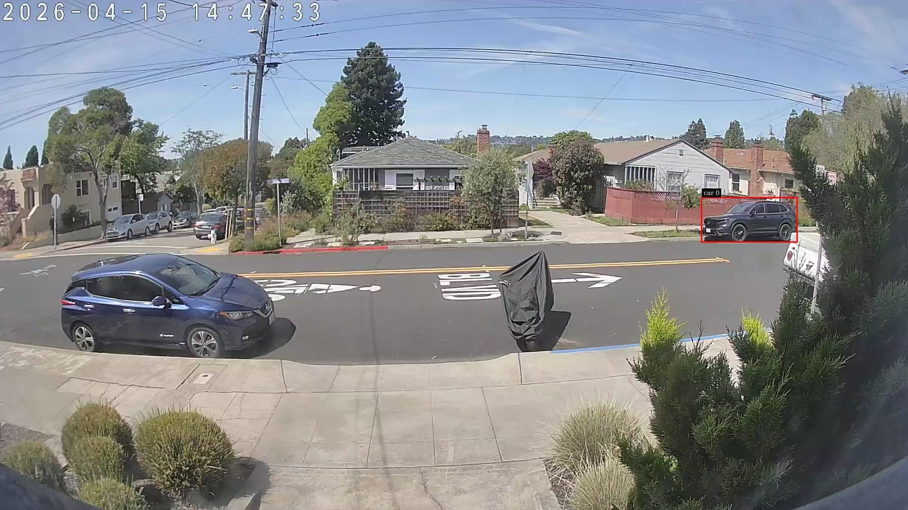

# when the unmap is impossible, the architecture is the bug

I had a Swift process pulling decoded video frames out of a GStreamer pipeline on a Jetson, through `appsink` and `gst_buffer_map`, and the process leaked memory at **roughly 65 megabytes per second** — fast enough to hit OOM inside a couple of minutes without a cgroup cap saving you. (And if your cgroup cap is wrong, you can also lock up the whole Jetson hard enough to need a power-cycle. Ask me how I know.)

The fix wasn't to debug the leak. The fix was to look at where the leak was and accept that the pipeline was telling me something about the design.

## The setup

The leaking process was the Swift edge-detection pipeline I wrote about a few weeks back — Swift 6.2 on a Jetson Orin Nano, replacing a 1,400-line Python + DeepStream stack. Originally it ran a GStreamer pipeline that terminated in an `appsink`; every frame, Swift pulled the buffer out, `gst_buffer_map`'d it, handed the bytes to a TensorRT YOLO engine, ran a Kalman tracker, drew bounding boxes on the frame, JPEG-encoded it, and served it as MJPEG to a browser. About 4,250 lines of Swift, including a hand-rolled SORT tracker and a 5×7 bitmap font renderer. (Yes, really.)

This worked, at 20 FPS, on a $250 device. It also leaked.

## Why it leaked

DeepStream on Jetson uses something called **NVMM** — NVIDIA Multimedia Memory. The whole point is zero-copy: NVDEC writes decoded frames into a CUDA-accessible surface pool, and downstream GPU plugins (`nvinfer`, `nvtracker`, `nvvideoconvert`) read straight from that pool without any CPU round-trip. The frames never leave GPU memory. Beautiful when everything stays on the GPU.

The catch is what happens when something *not* on the GPU tries to read a frame. Like a Swift process pulling bytes through `appsink`.

`gst_buffer_map(READ)` on an NVMM buffer pins an `NvBufSurface` pool entry. To release the pin you have to call `NvBufSurfaceUnMap` — the DeepStream-specific unmap, not the generic GStreamer one. NVIDIA's Python DeepStream sample carries an explicit warning about this on the equivalent code path: you MUST call the unmap, failing to do so causes severe leaks (memory grows to 100%+ in minutes). In Python, the bindings expose `unmap_nvds_buf_surface()` and the sample calls it. In Swift, calling `gst_buffer_unmap` at the GStreamer layer was supposed to handle it. It didn't.

I tried the obvious knobs. Different converter plugins (`nvvideoconvert`, `nvvidconv`). Property tweaks (`compute-hw=1`, `copy-hw=2`, `num-extra-surfaces=1`). Forcing an NV12 intermediate. A `queue leaky=downstream` upstream of the appsink. The leak canary on the host — `/sys/kernel/debug/nvmap/iovmm/allocations` — climbed from 65 MB to 3.1 GB in 30 seconds regardless. Every config leaked. The leak was specifically on the NVMM pool. And the Python DeepStream pipeline on the same source on the same device did not leak.

The mechanism I haven't confirmed but strongly suspect: `gst_buffer_unmap` doesn't propagate into `NvBufSurfaceUnMap` for DeepStream pool buffers in a process with no CUDA context, and Swift — talking to GStreamer through pure C interop, no `cudaSetDevice` anywhere — has no CUDA context. The design signal I have confirmed: I can't add a CUDA context to Swift cheaply. Either I embed CUDA myself (heavy lift, ABI risk) or I wrap the whole thing in a C++ shim that owns the context (which defeats the point of writing it in Swift). That's the moment to stop debugging.

## The thing the leak was telling me

The pattern was: I had a tool (DeepStream) whose entire design assumes everything stays on the GPU, and I was using it as a frame source for a process that wasn't on the GPU. The leak wasn't a bug. It was the architecture refusing the pattern.

Once you see it that way, the question stops being "how do I unmap correctly" and starts being "why is Swift touching NVMM at all?" What does Swift actually need from the pipeline?

Two things, it turns out. **Detections** — class, bounding box, tracker ID — to feed into the rest of the application logic (HTTP endpoints, the VLM sidecar, Prometheus metrics). And, when the user is watching a stream, **a JPEG to put on a web page**. That's it. Swift doesn't need pixels. Swift needs *metadata* and the *occasional rendered JPEG*.

Both of those have shapes that don't require pulling NVMM out of the pipeline.

DeepStream attaches detection results to GstBuffers as `NvDsBatchMeta` — flat C structs hanging off the buffer. You can read them in a pad probe without ever calling `gst_buffer_map`. That's how the Python detector reads detections; I just hadn't gone that far in the Swift version because I was still pulling raw frames anyway.

And `nvjpegenc` does the JPEG encode entirely on the GPU, then emits a system-memory buffer (~20 KB per frame). Mapping a system-memory buffer is free — that's just a malloc'd page, no NVMM pool entry to pin.

From there the redesign is straightforward, even if the implementation isn't. Tee the decoded NVMM stream into two branches. One goes through `nvinfer` + `nvtracker` + `fakesink`, and a pad probe pulls the detection metadata. The other goes through `nvdsosd` (which draws the bounding boxes from that same metadata, in-pipeline, on the GPU) and then `nvjpegenc` and `appsink`. Swift never sees an NVMM buffer.

## The pipeline that fell out

```text
rtspsrc location=$URL latency=200 protocols=tcp
  ! rtph264depay ! h264parse
  ! nvv4l2decoder
  ! m.sink_0 nvstreammux name=m batch-size=1 width=1920 height=1080
  ! nvinfer config-file-path=/app/nvinfer_config.txt
  ! nvtracker name=wendy_tracker
      ll-config-file=/app/tracker_config.yml
      ll-lib-file=/opt/nvidia/deepstream/deepstream-7.1/lib/libnvds_nvmultiobjecttracker.so
  ! tee name=t
  t. ! queue ! fakesink
  t. ! queue max-size-buffers=2 leaky=downstream
     ! nvvideoconvert ! nvdsosd ! nvvideoconvert
     ! nvjpegenc quality=85
     ! appsink name=mjpeg_sink emit-signals=false sync=false max-buffers=1 drop=true
```

Two non-obvious choices in there, both of which protect the new boundary.

The tee is **after** `nvtracker`, not before, so both branches carry the `NvDsBatchMeta`. That's what lets `nvdsosd` draw boxes on the MJPEG branch from the same metadata the pad probe sees — Swift never hand-renders anything.

There's only one `rtspsrc`. The camera enforces a single RTSP session, which I discovered when an earlier design (separate sidecar pulling its own RTSP for the MJPEG path) got disconnected on every connect. One source, decode once, tee.

The MJPEG branch always runs, but with `appsink max-buffers=1 drop=true` and a leaky queue in front of `nvjpegenc`, when nothing's connected to `/stream` the pipeline just drops frames at the appsink. One static pipeline, no conditional construction. A live frame from the MJPEG endpoint:



## What disappeared

The accounting on the Swift side is the part I keep coming back to.

- `DetectorEngine.swift` — TensorRT engine wrapper, ~360 lines. Gone. `nvinfer` does this in-pipeline.
- `YOLOPreprocessor.swift` — letterbox + normalize + HWC→CHW, ~190 lines. Gone. `nvinfer` config does this.
- `YOLOPostprocessor.swift` — confidence filter and coordinate decode, ~145 lines. Gone, replaced by a ~120-line C bbox parser plugin that DeepStream loads at runtime.
- `Tracker.swift` + `KalmanFilter2D.swift` — SORT tracker, ~700 lines. Gone. `nvtracker` runs NvDCF, which is a better tracker than the one I wrote.
- `FrameRenderer.swift` — bbox drawing, the 5×7 bitmap font, JPEG encode, ~570 lines. Mostly gone — `nvdsosd` draws boxes, `nvjpegenc` encodes.

Net: about 1,800 lines of Swift removed. What replaces it is ~150 lines of GStreamer glue in `GStreamerFrameReader.swift` plus ~130 lines of C shim that walks the `NvDsBatchMeta` linked lists and flattens the detections into a struct array Swift can consume:

```c
for (NvDsMetaList *fl = bm->frame_meta_list; fl && count < maxOut; fl = fl->next) {
    NvDsFrameMeta *fm = (NvDsFrameMeta *)fl->data;
    for (NvDsMetaList *ol = fm->obj_meta_list; ol && count < maxOut; ol = ol->next) {
        NvDsObjectMeta *om = (NvDsObjectMeta *)ol->data;
        out[count].classId    = om->class_id;
        out[count].confidence = om->confidence;
        out[count].left       = om->rect_params.left;
        // ...
        count++;
    }
}
```

That's the whole boundary. Swift code touches zero NVMM. Detection data crosses as a flat C struct. The pad probe runs on the GStreamer streaming thread and yields into an `AsyncStream<DetectionFrame>` that the rest of the app consumes like any other Swift async sequence.

Same FPS as before — 20 on the same 1080p RTSP source, which is what the camera delivers (both the old and new pipeline are source-limited, not compute-limited, at this input). The leak canary on `/sys/kernel/debug/nvmap/iovmm/allocations` is flat after warmup, where the old version had it climbing 65 MB → 3.1 GB in 30 seconds. RSS plateaus well under the 5 GiB cgroup cap and stays there across multi-hour soak runs, vs. the old behavior of OOM in single-digit minutes. Less code, no leak.

A caveat on the "flat" part, since I've since measured it more carefully: nvmap sits at ~206 MB steady-state under the current pipeline (Stage 2, MJPEG branch removed — see below). Earlier sub-versions had it at ~224 MB; the ~20 MB drop is from removing `nvjpegenc` + `nvdsosd` surfaces, not from any change in the source path. Direct camera and `mediamtx` relay paths both land in the same band; an earlier "the relay quadruples the baseline" reading I had was a measurement artifact, refuted by an A/B. Four minutes is too short to rule out slower growth; the original "no leak" confidence comes from the multi-hour soaks I ran earlier on the direct-camera path, not from a single benchmark. The head-to-head comparison against the Python original now has real data: a 300s concurrent run on the same relay stream with both detectors stable shows them processing 6,349 vs 6,350 frames over the window — effectively identical throughput at ~21 FPS each, with shared nvmap flat at 421 MB. Per-process VmRSS comes out at 797 MB (Python) vs 676 MB (Swift); both flat over the window. A separate 5-minute per-process CPU sample lands at 26.6% of one core for Swift and 52.1% for Python — a 1.96× ratio, reproduced at 1.93× after a later config change. Same fps, same NVIDIA stack downstream; the gap lives entirely in the host process. An earlier concurrent run had Python crashing partway through and Swift falling to 0.24 FPS, which I framed as VIC NVDEC contention; that framing is wrong and the current data supersedes it. The leak story in this post is solid either way — "leak vs. no leak" at 65 MB/s is not a close call.

## The slog (because it was real)

The redesign reads like it fell out cleanly and it didn't. The common thread is *cross-compiling for an embedded NVIDIA stack on an x86 host* — every layer (the Swift SDK, the aarch64 sysroot, the DeepStream headers, the container builder) has its own way of being almost-but-not-quite right. A few flavors:

- WendyOS ships a Swift cross-compile SDK for aarch64. The SDK was missing DeepStream headers and linker stubs. Fixed via a Yocto bbappend that packages them into the `-dev` part of the deepstream recipe and rebuilds the SDK image from source.
- 12-minute qemu-emulated `apt-get` cycles for `libcairo2` and friends, which turned into a manual hunt through `~/jetson/Linux_for_Tegra/rootfs/` to `COPY` the aarch64 `.so` files in directly.
- BuildKit cache shipping a stale binary at one point. An hour to track down.
- The build daemon getting stuck and needing a restart partway through.

None of that argues against the architectural lesson — if anything it sharpens it. On a stack like this, the time you save by getting the boundary right is the only thing that gives you back the time the platform takes from you. The lesson was the cheap part of the work. The slog was the rest of it.

## What I want to remember from this

**When the fix for a resource leak is this ugly, the architecture is telling you something.** I spent two days trying to get the unmap to propagate. The clue was sitting in front of me by hour two: *every* configuration leaked — not "this one config leaks because I forgot a flag" but "the entire class of configurations leaks." That's a design signal, not a bug. I just didn't take it seriously enough early enough.

**The cleanest version of this code is the one where Swift doesn't try to do NVIDIA's job.** I had been treating DeepStream as a frame source. It's not. It's a graph that runs on the GPU and produces metadata. The "useful" output isn't pixels, it's structured detections. Once Swift accepts that the pipeline owns rendering too — via `nvdsosd` and `nvjpegenc`, which are sitting right there waiting to be used — the boundary becomes obvious and small.

**Less code is the byproduct of a better fit, not the goal.** I didn't set out to delete 1,800 lines; I set out to stop the leak. The Kalman filter, the bitmap font, the letterbox — those were all me reimplementing pieces of DeepStream in Swift, and they all became unnecessary the moment Swift stopped being the renderer.

The right boundary in a system like this lives wherever the data actually wants to flow. When you find yourself fighting the framework to drag data across the wrong line, the leak is the framework telling you so.

---

## Stage 2: deleting the video from the detector

After this post went up, I kept going. The tee + MJPEG sidecar I described above — the branch that runs `nvdsosd → nvjpegenc → appsink` so a browser can pull frames — turned out to be another version of the same mistake. Not a leak this time, but the same pattern: code doing work it has no business doing.

The tee was consuming about 5 ms of extra preprocess latency (31.5 → 26.2 ms baseline when I toggled `MJPEG_DISABLED=1`). That's ~10% of a 50 ms frame budget. And the only reason it existed was that I needed a way to get video to a browser.

The stack already had `mediamtx` running as an RTSP relay — the camera accepts only one RTSP session, so mediamtx was already in the path to let both the detector and a second viewer see the stream. mediamtx ships WebRTC out of the box. Enabling it was a three-line config change. The browser connects via WHEP (a POST-offer / 201-answer exchange over HTTP), receives H.264 over RTP, and plays it natively. Sub-100ms latency. No GPU work in the detector at all for video.

So the `tee` is gone. `nvdsosd`, `nvjpegenc`, `nvvideoconvert`, the valve, the videodrop stub, the cairo libs in the container image — all gone. `MJPEGSidecar.swift` deleted. The pipeline is now just decode → mux → infer → track → fakesink. About 400 lines of Swift removed.

The bounding boxes still render. Stage 1 added a `requestVideoFrameCallback` loop that matches each presented video frame against a ring buffer of detection messages using `ptsNs` — the buffer's GStreamer PTS, propagated through the C shim and into the WebSocket JSON. When the browser gets a video frame callback with `metadata.mediaTime`, it converts that to nanoseconds, computes a calibrated offset from the first 8 frames, and picks the detection whose `ptsNs` is closest to the estimated playback PTS. The boxes are matched to the presented frame rather than trailing by the WebSocket delivery latency — on Chrome, where requestVideoFrameCallback is available.

The lesson I didn't see clearly enough the first time: the MJPEG sidecar was still me trying to do NVIDIA's job. The video was already in the RTSP relay. The detector doesn't need to know about it. The final architecture removed the MJPEG branch entirely because once you have an RTSP relay already in the stack, the cheapest encoder is no encoder.

---

## Postscript: what the numbers actually said

Between the Stage 2 deletion and this post going up, I ran a few more things.

**Python vs Swift under concurrent load.** 300 s window, both detectors against the same mediamtx relay, same YOLO26n FP16 engine, same custom parser, same NvDCF tracker. Identical throughput — 21.17 vs 21.16 FPS, 6,350 vs 6,349 frames. Shared `nvmap` bit-exact at 421,520 kB across the whole window. Per-process VmRSS Swift 676 MB vs Python 797 MB; both flat. An earlier inconclusive run had Python crashing partway through and I framed the result as VIC NVDEC contention — that framing was wrong, the real story is "same pipeline, same throughput." Not a surprise: the accelerator stages downstream of the pad probe are identical bytes in both containers.

**The one number that actually lives in the host process.** A separate 5-minute per-process CPU sample: Swift at **26.6% of one core**, Python at **52.1%**. A 1.96× ratio, reproduced at 1.93× after a later config change. Same FPS, same NVIDIA stack downstream, same custom parser — the gap is the probe callback. pyds walks `NvDsObjectMeta` via pybind11 under the GIL, with a `Counter.inc()` per detection, plus `defaultdict` updates and `Histogram.observe`. The Swift C shim flattens the same structs in under 100 µs, GIL-free. That's the clean language-layer signal the rest of the benchmark can't quite carry alone. What I haven't measured yet is what this curve looks like under K parallel streams, where a GIL-capped probe thread would plateau and the C-shim wouldn't. That experiment would either load-bear the scaling claim or refute it.

**A class filter that wasn't a perf win.** YOLO26 emits 80 COCO classes. The tracker was maintaining probationary tracks for every detection the model produced, including the couches and toasters YOLO occasionally hallucinates. Research said the knob was `operate-on-class-ids` on `nvtracker`. On DeepStream 7.1 that property doesn't exist; `gst-inspect-1.0 nvtracker` is authoritative and the docs I'd been reading were not. The right layer is `filter-out-class-ids` on `nvinfer`, which drops unwanted classes from metadata before they reach the tracker at all. One-line property per detector.

What it didn't do was move CPU: Swift went 26.6 → 27.8, Python 52.1 → 53.8 — inside tick-to-tick noise. YOLO26 wasn't producing many false positives in the dropped classes on this suburban-cars-and-dogs footage, so the tracker had nothing to save work on. The filter is correctness, not perf. Worth shipping anyway — the tracker shouldn't be paying probation cost for objects the application will never care about, even if today that cost is hidden.

**Sub-frame overlay alignment.** Stage 2's browser matched each presented WebRTC frame to a detection ring buffer by `ptsNs`, with a calibration offset derived from `video.mediaTime`. `mediaTime` is the playback clock — when the browser adjusts rate to compensate for jitter, it drifts against the source clock, and the overlay drifts with it.

The fix was `requestVideoFrameCallback`'s `metadata.rtpTimestamp` — the 90 kHz integer the encoder stamped on the RTP packet. Same clock domain on both ends. One calibration sample captures the offset; after that matching is unsigned-32 integer arithmetic with wraparound handling. Sub-frame residual.

The prettier version is **SEI in H.264** — detection JSON as `user_data_unregistered` NAL units inside the bitstream, pixel-perfect by construction. But `<video>` decodes and discards SEI; to read it you route the stream through WebCodecs (`VideoDecoder`) with your own JS H.264 Annex-B parser, lose `<video>`'s autoplay/controls/fullscreen, and accept that Firefox stable doesn't have WebCodecs. Days of work for precision that's already below the perceptual threshold at 21 FPS.

And the WebRTC **DataChannel** version — detections on a data channel alongside the video track — isn't feasible with mediamtx. It's media-only; SCTP data channels for custom payloads aren't exposed. Either patch mediamtx (Go work I'm not doing) or run a separate Swift WebRTC server next to it (days). Both paths' alignment win comes from rtpTimestamp matching, which I can get over the existing WebSocket transport.

So the final move was the lightweight one: keep the WebSocket, swap the matching key. A/B-able from a URL hash (`#lead=rtp`), falls through to the mediaTime path where `rtpTimestamp` isn't populated.

## What Swift actually built

NVIDIA built the detection — NVDEC, TensorRT, NvDCF, `nvinfer`, `nvtracker`, `nvdsosd`. Swift built the orchestration: zero buffer-map, typed `DetectionFrame` metadata, `AsyncStream`-shaped flow into Hummingbird + WebSocket fan-out, stable RSS, the CDI bind-mount plumbing that lets a 181 MiB image inherit a full DeepStream runtime at task start. The detection robustness in this stack is NVIDIA's. The robustness Swift contributed is for the host process: doesn't leak, doesn't crash, doesn't hang on the pad probe, doesn't need a CUDA context to stay alive.

That's the useful and achievable version of "production-ready Swift on Jetson."

## The bet

I started this because of a bet. Three years ago at a Swift meetup I made the case that Swift could do real embedded work — not iOS, not a Mac app, but production edge ML on the kind of NVIDIA hardware most of the industry writes in C++ or Python. I did the talk. I never published the recording — part of me wanted to ship something concrete before I did.

This is the something concrete.

- Talk recording: `[placeholder]`
- Repo: `[placeholder]`

What's still open, in the order I'd pick them up:

- **Multi-stream scaling curve.** Swift vs Python under K ∈ {1, 2, 4, 6, 8} streams against synthetic sources. Does Python's GIL-capped pad-probe plateau earlier than Swift's C shim? That's the question the single-stream 1.93× ratio can't quite answer on its own.
- **NvSORT tracker swap.** NvDCF's appearance features are wasted on objects that move smoothly through the frame for 1–2 seconds and rarely occlude; NvSORT is the cheaper Kalman-only tracker that needs no pixel data. Hours of config and revalidation.
- **`rtspsrc` auto-reconnect.** The current detector sits idle forever after an upstream EOS. Bus watch + teardown-and-rebuild, straightforward Swift work.
- **A sharper reliability audit.** Quantify post-port uptime properly with a stress-harness (periodic relay drops, camera teardowns) rather than the opportunistic numbers I have today.

Bet: paid.
